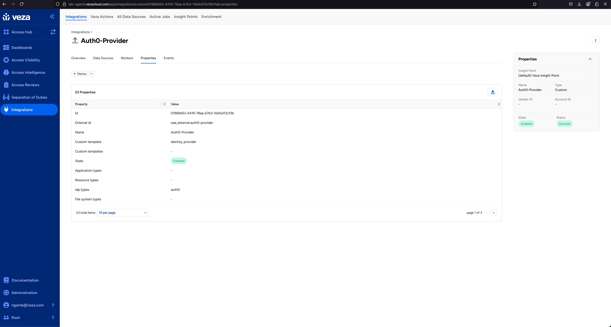
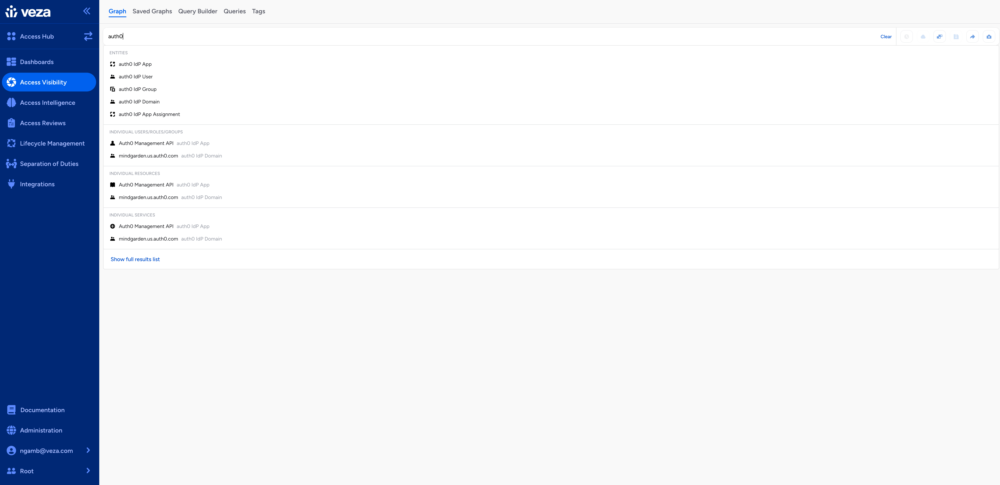
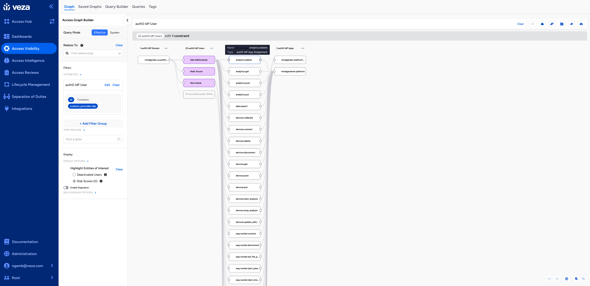
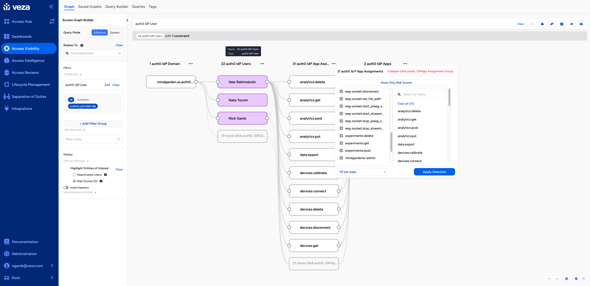
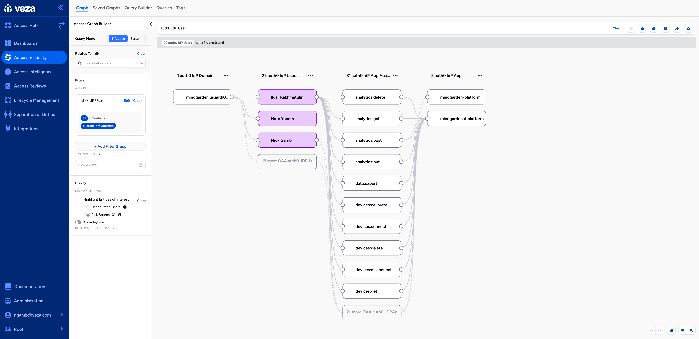

# Auth0 Integration for Veza Open Authorization API

This integration maps Auth0 identity and access management data to Veza's Open Authorization API (OAA), enabling comprehensive visualization and analysis of Auth0-based applications and APIs.

## Key Features

### User and Permission Management
- Complete user inventory with detailed attributes
- Granular permission tracking across applications
- Support for both direct and role-based permissions
- Unique permission identification using composite keys

### Role-Based Access Control
- Role hierarchy and inheritance mapping
- Permission assignments at role and user levels
- Group-based access control visualization

### Application Integration
- Resource server (API) permission mapping
- Client application access tracking
- Detailed application metadata and descriptions

### Organization Structure
- Organization hierarchy mapping
- Connection and authentication method tracking
- Group-based access visualization

## Screenshots

### Custom OAA Integration in Veza


### Veza Graph Query


### Auth0 Domains, Users, Groups, Apps, and Permissions in Veza Graph


### Filter based on Auth0 data in Veza Graph


### Visualize fine grained access in Veza for all applications/API's built using Auth0


## Requirements

- Python 3.9+
- Auth0 Management API access with required permissions:
  - `read:users`
  - `read:roles`
  - `read:resource_servers`
  - `read:clients`
  - `read:organizations`
  - `read:connections`
- Veza API credentials

## Configuration

Create a `.env` file with your credentials:

```bash
# Veza Configuration
VEZA_API_KEY="your-veza-api-key"
VEZA_URL="https://your-veza-instance.vezacloud.com"

# Auth0 Configuration
AUTH0_DOMAIN="your-tenant.auth0.com"
AUTH0_CLIENT_ID="your-client-id"
AUTH0_CLIENT_SECRET="your-client-secret"
```

## Installation

1. Clone and setup:
```bash
git clone https://github.com/your-name/oaa_auth0.git
cd oaa_auth0
python3 -m venv venv
source venv/bin/activate
pip install -r requirements.txt
```

2. Run the integration:
```bash
python3 auth0_provider.py
```

## Implementation Details

### Permission Handling
- Unique permission identification using composite keys (user/role ID + application ID + permission name)
- Support for both direct and role-based permissions
- Automatic duplicate detection and handling
- Granular permission mapping to applications

### Error Handling
- Rate limit detection with exponential backoff
- Comprehensive error logging
- Environment variable validation
- Graceful error recovery
- Automatic provider management

## Support

For issues and feature requests, please open an issue in the GitHub repository.

## License

Copyright 2024 Veza Technologies Inc.

Licensed under the MIT License. See [LICENSE](LICENSE) for details.
